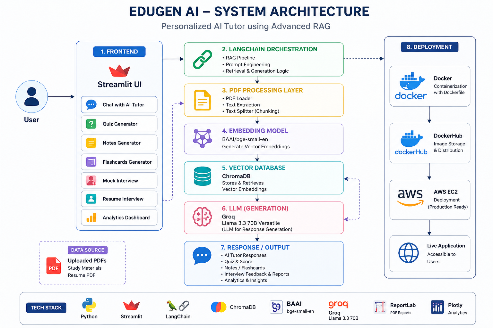
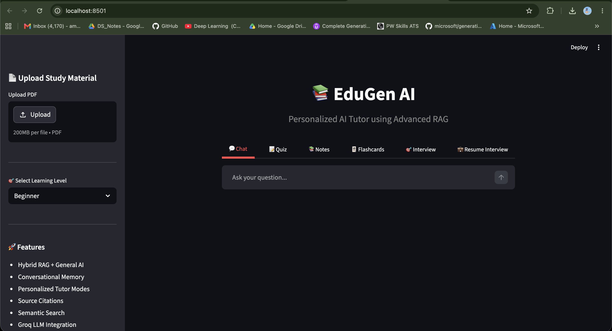
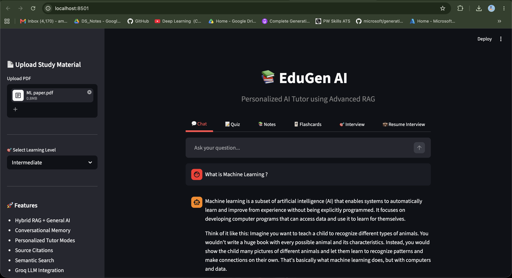
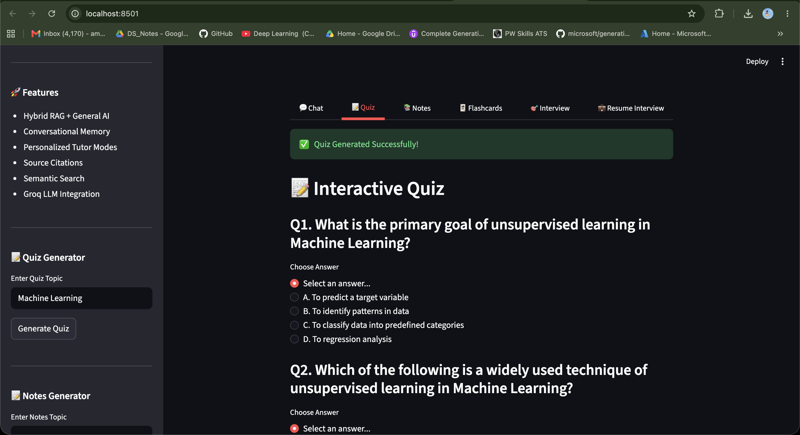
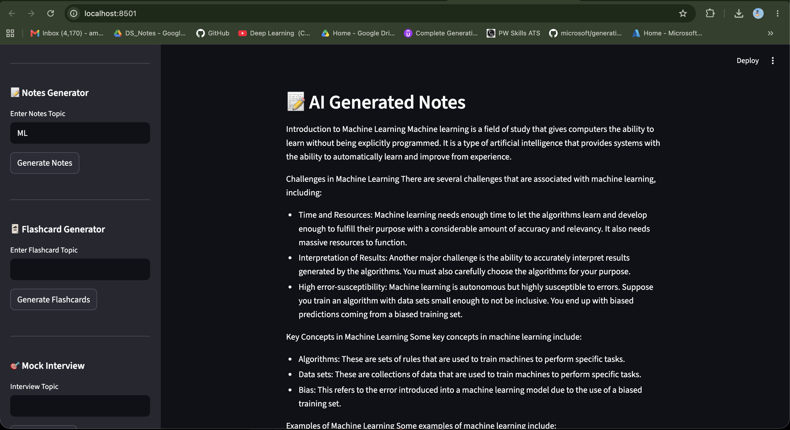
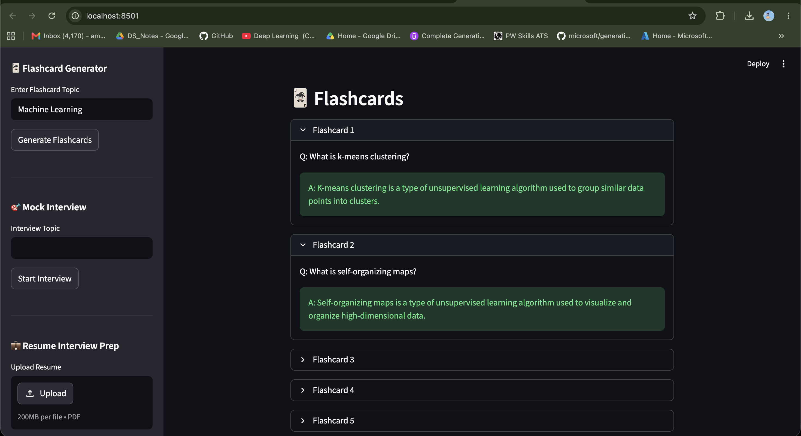
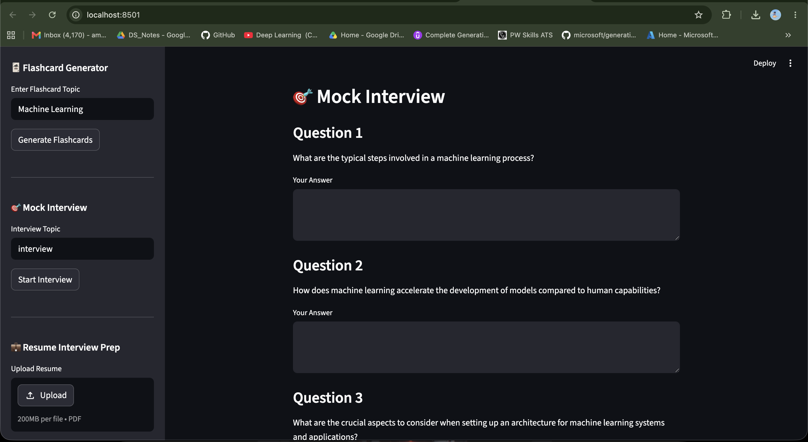
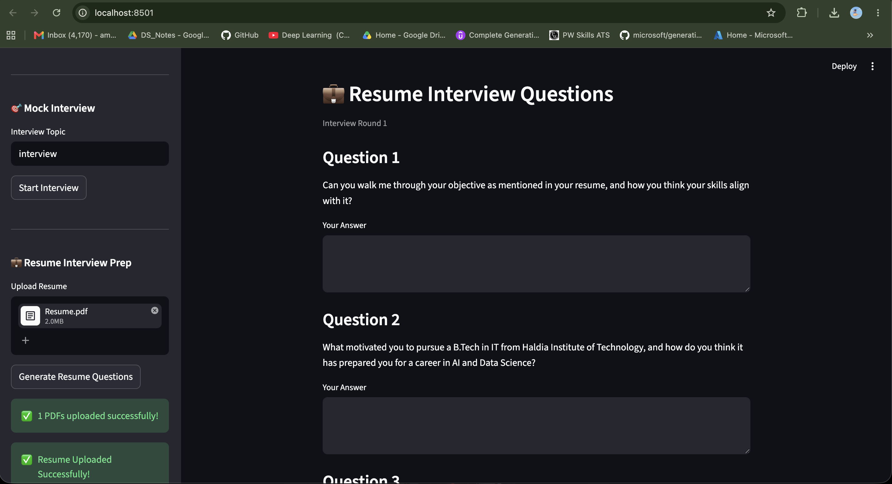
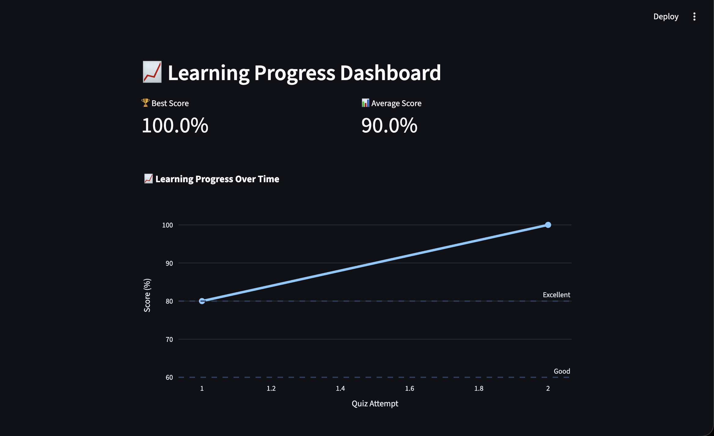

# 📚 EduGen AI - Personalized AI Tutor using Advanced RAG

EduGen AI is an end-to-end AI-powered learning platform that combines Retrieval-Augmented Generation (RAG), Large Language Models (LLMs), Resume-Based Interview Preparation, Learning Analytics, and Personalized Tutoring into a single application.

The platform enables students to upload study materials, interact with an AI tutor, generate quizzes, notes, flashcards, mock interviews, and receive personalized learning insights.

---

## 🚀 Features

### 💬 AI Tutor Chat

* Conversational AI Tutor powered by Groq Llama 3.3 70B
* Hybrid RAG + General AI Mode
* Personalized responses based on learning level
* Conversational memory support
* Source citations from uploaded PDFs

### 📝 Quiz Generator

* Generate topic-specific quizzes from uploaded study materials
* Automatic scoring
* Performance tracking
* Learning progress analytics

### 📚 Notes Generator

* AI-generated study notes
* Beginner, Intermediate, and Advanced learning modes
* PDF export support

### 🃏 Flashcard Generator

* Generate revision flashcards from uploaded content
* Quick learning and self-assessment
* PDF export support

### 🎯 Mock Interview Simulator

* Topic-based technical interview questions
* Answer submission and evaluation
* AI-generated feedback report
* PDF interview report generation

### 💼 Resume Interview Preparation

* Upload resume PDF
* Generate personalized interview questions
* Multiple interview rounds
* Resume-specific evaluation
* Resume Interview PDF Report
* Resume Interview Analytics Dashboard

### 📈 Analytics Dashboard

* Quiz Performance Analytics
* Resume Interview Analytics
* Best Score Tracking
* Average Score Tracking
* Historical Performance Monitoring
* Interactive Plotly Visualizations

---

## 🏗️ System Architecture


---

### Architecture Overview

EduGen AI follows a Retrieval-Augmented Generation (RAG) architecture.

- User-uploaded PDFs are processed using PDF Loader and Text Splitter.
- Text chunks are converted into vector embeddings using **BAAI/bge-small-en**.
- Embeddings are stored in **ChromaDB** for semantic retrieval.
- **LangChain** orchestrates retrieval, prompt engineering, and workflow execution.
- **Groq Llama 3.3 70B** generates personalized educational responses.
- The platform supports Chat, Quiz Generation, Notes, Flashcards, Mock Interviews, and Resume Interview Preparation.
- The entire application is containerized using **Docker** and is deployment-ready.

---

## 📸 Application Screenshots

### 🏠 Home Page



---

### 💬 AI Tutor Chat



---

### 📝 Quiz Generator



---

### 📚 Notes Generator



---

### 🃏 Flashcards Generator



---

### 🎯 Mock Interview



---

### 💼 Resume Interview



---

### 📈 Analytics Dashboard



---

## 🛠️ Tech Stack
## 🛠️ Tech Stack

### Frontend

* Streamlit

### Backend

* Python
* LangChain
* LangChain Community
* LangChain Groq

### Vector Database

* ChromaDB

### Embedding Model

* BAAI/bge-small-en

### Large Language Model

* Llama 3.3 70B Versatile (Groq)

### Data Processing

* PyPDF
* Pandas

### Visualization

* Plotly

### Reporting

* ReportLab

### Deployment

* Docker
* DockerHub
* Streamlit cloud (Live link)
* AWS EC2 (Deployment Ready) # for future

---

## 📂 Project Structure

```text
edugen-ai/
│
├── frontend/
│   ├── app.py
│   ├── components/
│   └── utils/
│
├── backend/
│   ├── pdf_loader.py
│   ├── embeddings.py
│   ├── vector_store.py
│   ├── retriever.py
│   ├── rag_chain.py
│   ├── quiz_generator.py
│   ├── notes_generator.py
│   ├── flashcard_generator.py
│   ├── interview_generator.py
│   ├── interview_evaluator.py
│   ├── resume_interview_generator.py
│   └── interview_report_pdf.py
│
├── tests/
├── Dockerfile
├── requirements.txt
└── README.md
```

---

## ⚙️ Installation

### Clone Repository

```bash
git clone https://github.com/Amankhan1009/EDUGEN-AI.git
cd edugen-ai
```

### Create Virtual Environment

```bash
python -m venv venv
```

### Activate Environment

Mac/Linux

```bash
source venv/bin/activate
```

Windows

```bash
venv\Scripts\activate
```

### Install Dependencies

```bash
pip install -r requirements.txt
```

### Configure Environment Variables

Create a `.env` file:

```env
GROQ_API_KEY=YOUR_GROQ_API_KEY
```

### Run Application

```bash
streamlit run frontend/app.py
```

---

## 🐳 Docker Setup

### Pull Docker Image

```bash
docker pull amankhan1009/edugen-ai:latest
```

### Create .env File

```env
GROQ_API_KEY=YOUR_GROQ_API_KEY
```

### Run Container

```bash
docker run -p 8501:8501 --env-file .env amankhan1009/edugen-ai:latest
```

### Open Application

```text
http://localhost:8501
```

---

## 🔮 Future Enhancements

* Multi-user authentication
* User profile management
* Learning recommendations engine
* Adaptive quiz difficulty
* Voice-based tutoring
* Real-time collaborative learning
* Cloud deployment with CI/CD
* Learning path generation
* Advanced analytics and reporting

---

## 🎯 Key Highlights

* Retrieval-Augmented Generation (RAG)
* Resume-Based Interview Preparation
* Personalized Learning Experience
* Learning Analytics Dashboard
* AI-Powered Educational Assistant
* Dockerized Deployment
* AWS Deployment Ready
* End-to-End Generative AI Project

---

## 👨‍💻 Author

* Md Aman Alam
* amankhan34356@gmail.com

Built as an AI-powered educational platform leveraging RAG, LLMs, Vector Databases, and Modern MLOps practices.
